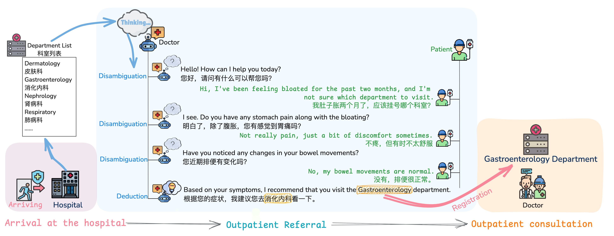

# IOR-Bench

## Large Language Models for Outpatient Referral: Problem Definition, Benchmarking and Challenges


<p align="center">
  <font size="3">&nbsp<a href="https://arxiv.org/abs/2503.08292">📃 Paper</a>｜&nbsp<a href="https://huggingface.co/spaces/puccho/Soundwave"><a href="https://huggingface.co/">🤗 Data</a>&nbsp
</p>


<p align="center">
  
</p>
In this research, we formulate the outpatient referral problem into two key sub-tasks: (a) a static classification task, where the goal is to match patient information with the most appropriate department from a predefined list of hospital departments; and (b)a dynamic questioning task, in which the system engages in iterative dialogues with patients to progressively refine and improve referral recommendations. We further propose two evaluation methods for these sub-tasks: static and dynamic evaluation. Static evaluation leverages various prompt strategies to assess model robustness in the static classification task, while dynamic evaluation simulates real-time doctor-patient dialogues to evaluate the model's ability to enhance referral accuracy through iterative questioning. 

## Getting Started

### Environment Setup 

<font size="3">Python version 3.10 is used in this project.</font>

```bash
conda env create -f environment.yml
```

### Inference

For IOR-Static evaluation, run:

```bash
sh ./scripts/static_evaluation.sh
```

For IOR-Dynamic evaluation, run:

```bash
sh ./scripts/dynamic_evaluation.sh
```

### Evaluation

For IOR-Static evaluation calculation, run:

```bash
sh ./scripts/static_calculation.sh
```

For IOR-Dynamic evaluation calculation, run:

```bash
sh ./scripts/dynamic_calculation.sh
```

## Citation

```
@misc{liu2025largelanguagemodelsoutpatient,
      title={Large Language Models for Outpatient Referral: Problem Definition, Benchmarking and Challenges}, 
      author={Xiaoxiao Liu and Qingying Xiao and Junying Chen and Xiangyi Feng and Xiangbo Wu and Bairui Zhang and Xiang Wan and Jian Chang and Guangjun Yu and Yan Hu and Benyou Wang},
      year={2025},
      eprint={2503.08292},
      archivePrefix={arXiv},
      primaryClass={cs.CL},
      url={https://arxiv.org/abs/2503.08292}, 
}
```
